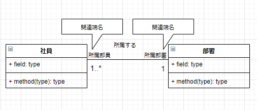

# クラス図

## 図の目的
  * クラスの情報やクラス間の関係から、システムの**静的な**構成を見えるようにする。

* 使用する工程
  * 分析、アーキテクチャ設計、詳細設計、実装、テスト

* クラス図とは
  * オブジェクトの情報を抽象的に定義した図。クラスとオブジェクトには型と実体の関係がある。
  * クラスの情報やクラス間の関係からシステムの静的な構成を表現する。
  * システムを実現するにあたり、システムの"動的な構成"と"静的な構成"どちらも重要だが、クラス図は静的な構成を表し、プログラミングにも密接に関わる。

  * | クラス（型） | オブジェクト（実態） |
    | :- | :- | 
    | 社員 | 鈴木、佐藤 |
    | 部署 | 開発部、人事部 |

## 「クラス」の表記法

   


## 可視性

| 記号 | 表現 | 意味 |
| - | - | - |
| + | public | すべてのクラスからアクセス可能 |
| - | private | 自クラスからのみアクセス可能 |
| # | protected | 同一パッケージと継承されているクラスからアクセス可能 |
|~ | package | 同一パッケージ内のクラスからアクセス可能 |


## 関連

2つのクラスが以下の関係にあるとき、関連として表す。
* 一方のクラスがもう一方のクラスのデータを属性（フィールド）として保持する。
    ```
    class A
    {
        private B;
    }
    ``` 
* 一方のクラスがもう一方のクラスの操作（メソッド）を呼び出す。
    ```
    class A
    {
        private int value;

        public int getSumValue(B b)
        {
            return b.getValue + this.value; ←Aクラス内でBのメソッドを呼び出している。
        }

    }
    
    class B
    {
        private int value

        public int getValue()
        {
            return this.value;
        }
    }
    ```

* 関連の表現はクラス間を実線で結び、実線の中央に「関連名」を配置する。
  * ※ あるクラスがもう一方のクラスとの間で複数の関係を持っている場合、その一部だけに注目して関連名を定義してしまうと、システム全体としての関連を表現できていない事になるため、一つの関係だけではなくシステム全体から見て名称を定義することが重要

    　


## 誘導可能性

* 関連は通常の場合、双方向性を持っているが、オブジェクト間のやりとりがあきらかに一方通行の場合は関連に「矢印」と「×」をつけることで関連の方向性を明確にする。

  

## 多重度

  * 関連のあるクラス間において、一方のクラスからもう一方のクラスを見た時に存在しうる数値を多重度として表す。
  
  * | 多重度 | 意味 |
    | :- | :- |
    | 1 | 1のみ |
    | * | 0以上 | 
    | 0..* | 0以上 | 
    | 1..* | 1以上 |
    | 5..8 | 5 ~ 8 |
    | 1,3,5 | 1 or 3 or 5 |
    |1,4..7 | 1 or 4 ~ 7 |

  * 下記の図は「1つの部署に対して社員が1人以上所属する」ことを表現する。

    

## 関連端名

  * 関連のあるクラス間において、一方からもう一方のクラスを見たときの役割を関連端名として表す。

  * 下記の図は「社員」と「部署」で「所属する」という関連があり、社員から部署を見れば、「所属部署」となり、部署から社員を見れば「所属部員」となる。
  
    


## 限定子

  * 限定子は関連の一種で、1対多の関係があるクラス間において、一方のクラスのインスタンスがもう一方のインスタンスを特定する際、どの属性を用いるかを表したもの。

  * 社員と部署が1対多の関係であるとき、部署クラスの「社員ID」属性を限定子とすることで、社員を1人に特定することができる。（社員IDは社員ごとに割り振られる一意のキー）
  
    


## 汎化

  * 一方のクラスが、もう一方のクラスをより具体化したクラスである場合のクラス間の関係。汎化は頭に白抜きの三角形がついた実践で表す。

  * 下記の図で「営業社員」と「開発社員」クラスは、「社員」クラスをより具体化したクラスであるため、汎化の関係である。

  * 矢印を指している「社員」（スーパークラス）から見て逆に「営業社員」、「開発社員」クラスを**特化**という
  
    

## 集約

  * クラス間に「全体 - 部分」（全体にあたるクラスの部分にあたるクラスを包含する）の関係がある場合に使用する。

      

## コンポジション

  * 集約の一種で、全体のインスタンスが部分のインスタンスを所有するとき、その部分の生成／消滅の責務を全体のインスタンスのみが担う場合コンポジションを使用する。

      

## 依存

  * オブジェクト間にさほど強くはないが、何らかの関係がある場合に使用する。
    * 例えば、一方のオブジェクトがもう一方のオブジェクトを操作（メソッド）で利用したり、何らかの影響を受けたりする場合

      

## インターフェース

  * クラスが実現しなければならない操作のみ定義されている。
  * インターフェースはステレオタイプ\<\<interface>>で表す
  * インターフェースは定義を行うだけで操作の具体的な処理はサブクラスで定義する。このインターフェースとサブクラスの関係を「実現」という。
  * この関係は汎化の一種でクラス図では頭に白抜き三角形のついた破線で表す。
  * インターフェースを特に明示する必用がない場合は「ロリポップ」でも表現可能

      


## クラス図の書き方

  * 分析クラス図と設計クラス図について
    * 分析クラス図
      * 分析工程において、シーケンス図やアクティビティ図などをもとにして、クラスを抽出し、クラス間の関連や一部の操作を表記した「分析クラス図」を作成する。
    * 設計クラス図
      * 設計工程において、シーケンス図やアクティビティ図などをもとにして、属性や可視性などを表記した「設計クラス図」を作成する。
      * 設計クラス図は、分析クラス図をより詳細に表現したクラス図。必ずしも設計クラス図が完成した後に実装に入らなければいけないわけではなく、実装しながらクラス図を修正しても問題ないが、クラス図と実装の整合性が取れている事が大事である。

    * 分析クラス図の書き方
      * オブジェクト図編
        * 元になるオブジェクト図
          

        * このオブジェクト図からクラス図を抽出し、クラス間の関連を作成すると以 下のようになる。
          

        * 次にオブジェクト図から読み取れる「属性」、「多重度」、「関連名」、 「関連端名」を配置する。
          

      * ユースケース図編       
        * 元となるユースケース図
         

        * クラス図には「マネージャ」を追加。また、ユースケース作成時に注意点があればノートして記載する。
         

    * 設計クラス図の描き方
      * シーケンス図編
        * 元となるシーケンス図
          

        * 社員クラスに属性名とその型を配置し、操作「ログインする」の引数
        に可視性を追加
          

## 補足事項

  * 関連クラスについて
    * クラス間の多重度が多対多の場合は実装が困難になる。その場合はクラス間に関連クラスを新たに作成することで多対多の関係を一対多にする。
        

    * 分析クラス図の対応
      * 「所属する」関連を「所属情報」関連クラスに変更
          
    
    * 設計クラス図の対応
      * 次のように関連クラスを展開することで2本の関連に変更
        

    * 注意点
      * 分析クラス図では「社員」クラスと「部署」クラスにあった多重度が、設計クラス図では「所属情報」クラスの多重度になる。こうすることで多対多の関係が解消される。

## 分析クラス図と設計クラス図の役割
  
  * 分析クラス図
    * 分析段階で開発対象となるシステムがどのようなシステムであるかを把握するために、分析クラス図を作成する。その際はまだプログラムに関する視点は不要。
 
  * 設計クラス図
    * プログラミングが可能かどうかという観点を踏まえて分析クラス図に対して、追加や変更を行う。例えば、多対多の関連クラス図の展開などはまさしくプログラミングを可能にするための変更作業。