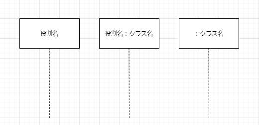

# シーケンス図

## 相互作用図

 * 「もの」、「ひと」同士のメッセージのやり取りを表現する図で、ユースケース図の具体例として記述したシナリオに沿って作成する。
 * シナリオには日本語の文章を箇条書きで記述するが、相互作用図では「もの」や「ひと」（ライフライン）同士のメッセージのやり取りとして表現する。

 * 相互作用図の種類

   * シーケンス図
    
     * 上から下に、時系列に沿った処理の流れをメッセージのやり取りとして表現する。

   * コミュニケーション図
     
     * ライフライン同士の接続関係に着目しつつ、関係しているライフライン同士のメッセージのやり取りを表現する。
    
    * シーケンス図とコミュニケーション図の使用順序は特に定められておらず、上記の特徴を理解し、使用しやすい方を先に使用する。必用がなければ、どちらか一方でも可

## シーケンス図とは

  * 

  * ライフライン同士のメッセージを上から下に、順番に配置する。

  * 処理の順番が明確な場合に時系列に沿って処理の流れを記述するのに適している。

  * ビジネスシステムは、処理の流れが明確な場合が多い為、シーケンス図がよく利用されている。

  * シーケンス図を描くときは、メッセージが左から右に流れ、見やすいようにライフラインを配置する。

## ライフライン

  * ライフライン 
    * ライフラインは相互作用の参加者を表現する。ライフラインは長方形で表現し、長方形から下に向かって点線を引く。点線はライフラインが存在している期間を表す

  * ライフラインの生成と消滅
    * ライフラインの点線がライフラインの生存期間を示すので、ライフラインを生成するメッセージは、ライフラインに対して点線矢印を直接引く。また、ライフラインの消滅を示すには、×印をライフラインの点線の末端に記述する。
      * 

  * ライフラインの表記
    * ライフラインは長方形の中にライフライン名を記述して表現する。
    * ライフラインは「役割のみ」、「役割名とクラス名」、「クラス名のみ」の3通りで表記することができる。
      * 

## メッセージ

  * メッセージ
    * ライフライン間のコミュニケーション（情報のやり取り）を表現するには、2つのライフラインの点線間にメッセージの矢印を引く。矢印の表記には「先端を塗りつぶした矢印」(同期メッセージ)、「矢印」（非同期メッセージ）、「点線矢印」（戻り（リプライ））の3種類がある。また、メッセージラベルをつける。
      * 

  * 先端を塗りつぶした矢印
    * **同期メッセージ（階層化しているメッセージ）** を表す。次の場合「M1」の呼び出し終了を待って「M3」の呼び出しを行う。
      * 

  * 矢印
    * **非同期メッセージ（階層化していないメッセージ）** を表す。次の場合「M1」の呼び出し終了をまたずに、「M3」を呼び出す。 
      * 

  * 点線矢印
    * 同期メッセージの戻り（リプライ）を表す。次の「R1」、「R2」、「R3」それぞれ「M1」、「M2」、「M3」に対する戻り（リプライ）を表現している。
      * 

## シーケンス図の応用表記（1）

  * 相互作用使用
    * 相互作用使用を用いることで、ある相互作用から他の相互作用を参照することができる。フレームヘッダに"ref"を入れ、フレームの中に、参照先の相互作用名を書く。 
      * 

  * 処理の分岐
    * フレームヘッダに「alt」を入れると、分岐を表現することができる。フレームを破線で区切り、分岐する条件をガードで表現します。ガードは"[ ]"内に条件を記述します。
      * 

  * 処理の繰り返し
    * フレームのヘッダに"loop"を入れることで、処理の繰り返しを表現することができる。"loop"の後に繰り返し数を"[]"に入れて記述する。
      * 

  * 平行処理
    * フレームヘッダに"par"を入れることで、並行処理を表現することができる。
      * 

  * 統合フラグメントについて
    * 「alt」、「loop」、「par」は統合フラグメントと呼ばれる。

