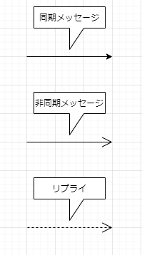

# コミュニケーション図

## ライフラインの表記
  * ライフラインは、長方形で表記し、長方形の中にライフライン名を配置する。ライフライン名はシーケンス図と同様に、次のようなフォーマットで「役割名のみ」、「役割名とクラス(分類子)名」、「クラス名のみ」の3通りで表記する。しかしコミュニケーション図のライフラインはシーケンス図と異なり、長方形の下に点線はつかない。
    * ※分類子は「クラス」、「データタイプ」、「インターフェース」、「コンポーネント」の総称。
    * 

## ライフライン間の関係
  * ライフライン間にメッセージの送信等データのやり取りが存在するとき、ライフライン間に実践を引く。
    * 
  
## メッセージ
  * ライフライン間の関係を表現する実線にメッセージを置くことで、ライフライン間のコミュニケーション（情報のやり取り）を表現する。

    * 同期メッセージ
      * ある操作が他の操作を呼び出しているような**階層化している**メッセージの呼び出しを表現する。
      
    * 非同期メッセージ
      * **階層化していない**メッセージの呼び出しを表現する。
      
    * リプライ
      * 戻りメッセージ（リプライ）を表現する。
      
  * 

## 並行処理

  * 並行処理
    * メッセージが同時並行的に送信されていることを示すときは、シーケンス番号の末尾に、アルファベットを付ける。次の図では、「：パーティの料理」ライフラインへの「2a：注文予約」と「：招待状」ライフラインへの「2b：作成」とが同時送信されていることを示す。
     * 

## 先行子

  * あるメッセージを送信するに先立ち、別のメッセージの送信が行われる必要がある場合に指定する。先行して送信されるメッセージのシーケンス番号を、次のフォーマットでメッセージの先頭につける。
    * `先行子/シーケンス番号 返却値：＝メッセージ名（引数並び）`
  
  * 次の図では、「：招待客」に対して「2c/3b:招待状の送付」を返信する前に、「：候補者リスト」に対して「2c:招待客リストの抽出」を送信する必用がある。
    * 

## コミュニケーション図と他の図との関係 

  * コミュニケーション図とシーケンス図
    * コミュニケーション図とシーケンス図は、ライフラインのメッセージをやり取りするという点では同じのため、コミュニケーション図とシーケンス図はどちらかで作成したものを他方へ変換することが可能
      * 

  * コミュニケーション図とクラス図
    * コミュニケーション図でメッセージを送信するということは、メッセージの受信側ライフラインに対応するクラスが持つ操作を呼び出しているということ。
    
    * ライフライン同士でメッセージを送信し合っているということはそのライフラインに対応するクラス間に関係が存在することを示している。
　　
    * コミュニケーション図のライフラインとメッセージはクラス図におけるクラスと操作に対応する
      * 

## オブジェクト

  * オブジェクトとは
    * オブジェクトは物理的または概念的な「ひと」、「もの」、「こと」を指す。具体的なオブジェクトには「家」、「自動車」、「テレビ」といった目に見えるもの以外に、「売上」、「ルール」、「契約」など目に見えないものがある。

    * オブジェクトは属性という静的な情報と操作（ふるまい）という手続きを持っている。また、オブジェクトは生成されてから消滅するまで、いくつかの状態を持っている

  * オブジェクトの表記(1)

    * オブジェクトは、長方形の中に下線を引いたオブジェクト名を記述して表現する。下記のようなフォーマットで「オブジェクト名」、「オブジェクト名：クラス名」、「：クラス名」の3通りで表記することができる。
      * <u>**オブジェクト名：クラス名**</u>
      * 

  * オブジェクトの表記(2)
  
    * オブジェクトに対応するクラスがどのパッケージに含まれているかを明らかにするときは、オブジェクト名を修飾しているクラス名に対してさらにパッケージ名で修飾して表記する。また、オブジェクト図に属性値を表示することもできる。

      * 

## オブジェクト図の概要

  