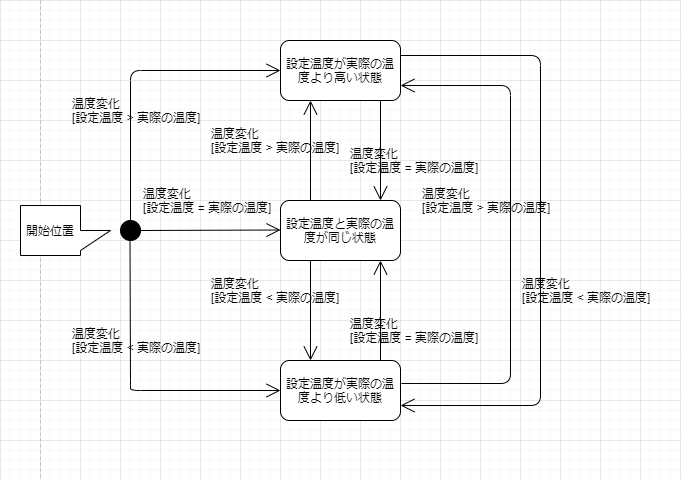
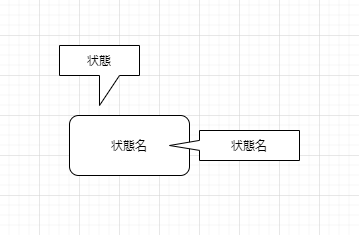
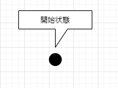
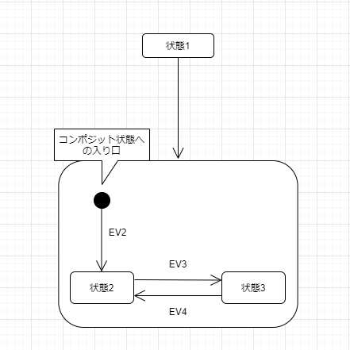

# ステートマシン図

## ステートマシン図の概要
  * オブジェクトの状態とは
    * オブジェクトはデータ（属性）と振る舞い（操作）と状態を持つ。たとえば、エアコンの設定温度を考えた場合、次の3つの状態が考えられる。
      * エアコンの設定温度が実際の温度より高いとき
      * エアコンの設定温度と実際の温度が同じとき
      * エアコンの設定温度が実際の温度より低いとき

    * ステートマシン図は複雑な状態を持ったクラスについてのみ作成する。（ビジネス系ではあまり必要性を感じないかもしれないが、組み込み系では必須。

## ステートマシン図とは
  * 相互作用図では、ライフライン同士におけるメッセージやり取りで、システムの動的な振舞いを表現してきた。それに対してステートマシン図では、1つのオブジェクトが生成から消滅までに、時間の経過に伴って変化する状態について表現する。

  * さきほどのエアコンの設定温度をステートマシン図で考えると、「設定温度が実際の温度より高い状態」、「設定温度と実際の温度が同じ状態」、「設定温度が実際の温度より低い状態」の3つの状態があり、そのトリガによって変わることを表現している。

  * 

## 状態
  * オブジェクトの生成から消滅までの中で、ある一定時間とどまる状況のことを、状態という。状態は丸い長方形で表現し、その中に状態名を記述する。

  * 

## 開始状態
  * 開始状態はステートマシン図の開始時点（オブジェクト生成時）を示す特別な状態。図中では黒丸で表現する。

  * 開始状態はコンポジット状態の開始時点で示す特別な状態でもある。

    * 

  * コンポジットの状態がない限り開始状態は一つだけ表記する。終了状態は必用な数だけいくらでも記入できる。

    * 

