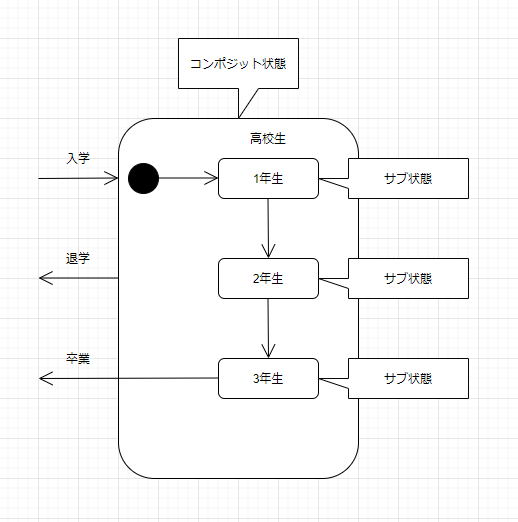
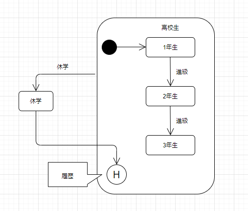
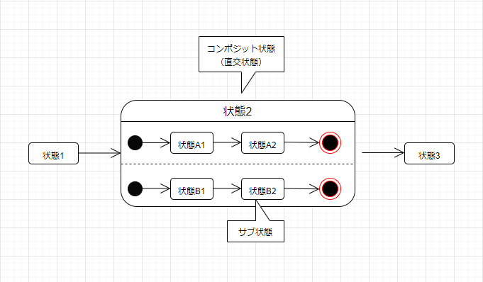
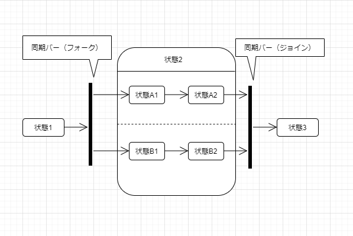

# ステートマシン図

## ステートマシン図の概要

  * ステートマシン図はオブジェクトの「状態」を表現する。

  * オブジェクトの状態とは
    * オブジェクトはデータ（属性）と振る舞い（操作）と状態を持つ。たとえば、エアコンの設定温度を考えた場合、次の3つの状態が考えられる。
      * エアコンの設定温度が実際の温度より高いとき
      * エアコンの設定温度と実際の温度が同じとき
      * エアコンの設定温度が実際の温度より低いとき

    * ステートマシン図は複雑な状態を持ったクラスについてのみ作成する。（ビジネス系ではあまり必要性を感じないかもしれないが、組み込み系では必須。

## ステートマシン図とは
  * 相互作用図では、ライフライン同士におけるメッセージやり取りで、システムの動的な振舞いを表現してきた。それに対してステートマシン図では、1つのオブジェクトが生成から消滅までに、時間の経過に伴って変化する状態について表現する。

  * さきほどのエアコンの設定温度をステートマシン図で考えると、「設定温度が実際の温度より高い状態」、「設定温度と実際の温度が同じ状態」、「設定温度が実際の温度より低い状態」の3つの状態があり、そのトリガによって変わることを表現している。

  * 

## 状態
  * オブジェクトの生成から消滅までの中で、ある一定時間とどまる状況のことを、状態という。状態は丸い長方形で表現し、その中に状態名を記述する。

  * 

## 開始状態
  * 開始状態はステートマシン図の開始時点（オブジェクト生成時）を示す特別な状態。図中では黒丸で表現する。

  * 開始状態はコンポジット状態の開始時点で示す特別な状態でもある。

    * 

  * コンポジットの状態がない限り開始状態は一つだけ表記する。終了状態は必用な数だけいくらでも記入できる。

    * 

## 終了状態
  * 終了状態はステートマシン図の終了時点（オブジェクト消滅時）、または状態が階層化されているときに、そのレベルの終了時点を示す特別な状態。図中では中の丸を塗りつぶした2重丸で表記する。 

  * 

## トリガ
  * トリガはある状態に対し、何らかの影響をもたらす事象の発生のこと。

  * トリガが発生すると、遷移が起こる。

  * 次の例は、洗濯機の状態の一部で、「注水」の状態から「満水」というトリガが発生すると、「洗濯」状態になる。

  * 

## 状態遷移
  * 「注水」の状態から「洗濯」の状態に変わったようにある状態からある状態へ変わることを、状態遷移という。

  * 

## 自己遷移
  * 自分自身の状態に入りなおすことを自己遷移という。

  * 

## 完了遷移（トリガレス遷移）

  * トリガではなく、アクションやアクティビティの終了をきっかけとして他の状態に遷移することを、完了遷移という。次の例は、テープの「巻き戻し」状態で「テープの巻き戻し」アクティビティが起動し、それが終了次第「停止」状態に遷移することを示している。

  * 

## ガード状態

  * 複数のトリガがある場合、どちらに分岐すべきかを指定するために、トリガの後ろにガード条件を記述する。ガード条件は **[]** で囲んで記述する。

  * 

## エフェクト

  * トリガが起きて、遷移状態が発生したときに、稼働する動作をエフェクトとして指定することができる。エフェクトは次のフォーマットに従って記述する。
    * **トリガ[ガード条件]/エフェクト**

  * 

## 入場アクション／退場アクション

  * 状態に入るときに起動するアクションを **入場アクション** 、状態から出るときに起動するアクションを **退場アクション**として記述できる。

  * 入場アクションは **entty/** 退場アクションは **exit/** に続けて記述する。

  * 次の状態は「注水」状態に入ると「注水口が開く」が実行され、「注水」状態から出ると、「注水口が閉じる」が実行される。

  * 

## アクティビティ

  * **アクティビティ** は状態に入ると開始され、状態から抜け出す（または動作完了）まで継続的に行われる操作。次の例では「注水」状態に入ると注水が開始し、「注水」状態から出るまで注水が継続される。

  * 

## コンポジット状態

* 状態の中に状態を階層的に持たせる事によって、複雑な状態をわかりやすく表現することができる。

* 状態の内部に状態を持っている事を**コンポジット状態**という。内部にある状態のことをサブ状態という

* 次の例では、「高校生」状態の中に「1年生」、「2年生」、「3年生」という3つのサブ状態があります。この例では、「高校生」がコンポジット状態となる。

  * 

## 履歴

* 履歴があると、コンポジット状態から出るときにいたサブ状態を記憶しておき、再度コンポジット状態に入ったときにいたサブ状態を記憶しておき。再度コンポジット状態に入ったとき、元いたサブ状態に戻ることができる。履歴は「H」を丸で囲んで表現する。

* 次の例では「1年生」、「2年生」、「3年生」のいずれかの状態にいて、「休学」イベントが発生すると、「休学中」状態になる。その後「復学」イベントが発生し「高校生」状態に戻る際に履歴を参照し、もといたいずれかの学年に戻ることになる。履歴がないと開始状態に遷移するため、必ず「1年生」状態から始めることになる。

  * 

## 直行状態

* 1つのコンポジット状態の中で、同時に複数のサブ状態が存在する場合、**直行状態**で表現する。直行状態は内部で区切ったコンポジット状態で表現する。

* 次の状態は「状態1」から「状態2」に遷移すると、「状態A1」と「状態B1」の両方の状態になる。その後「状態A1」が「状態A2」となり、「状態B1」が「状態B2」になり、「状態3」に遷移する。

* 同時に複数の状態が存在する場合に使用

  * 

## 並行遷移

* 同期バー(フォークとジョイン)を表記することで、分岐または合流の同期を明確に表現できる。

* 分岐や合流において同期を取りたい場合に使用

* 次の例では「状態1」の次に同時に「状態A1」、「状態B1」に遷移が行われる。その後「状態A2」、「状態B2」の両方が終了した時点で「状態3に遷移することを示している。

* **「状態A2」、「状態B2」のどちらかが先に終了した場合は他が終了するのを待ってから「状態3」に遷移が行われる。**

  * 
