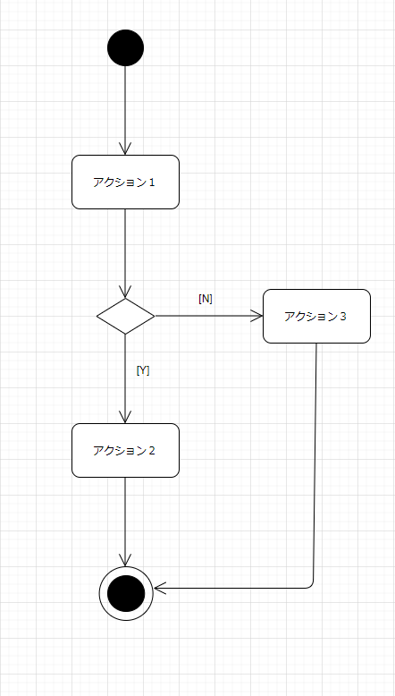
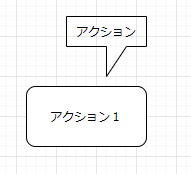
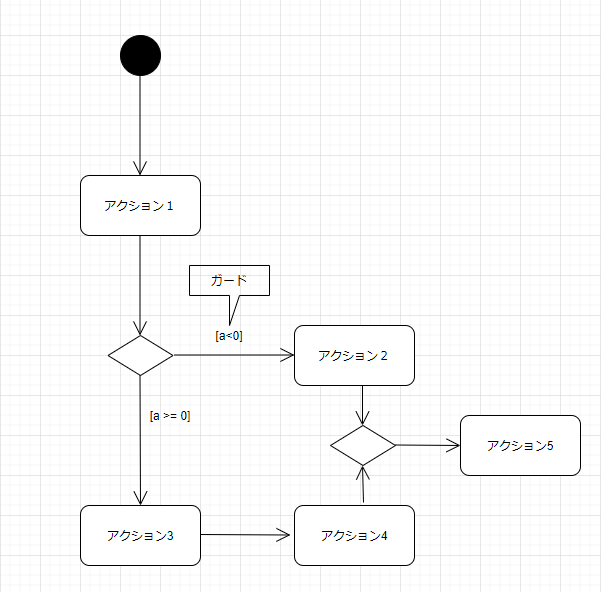
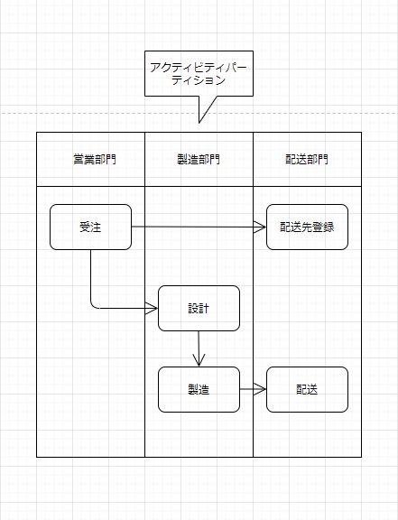
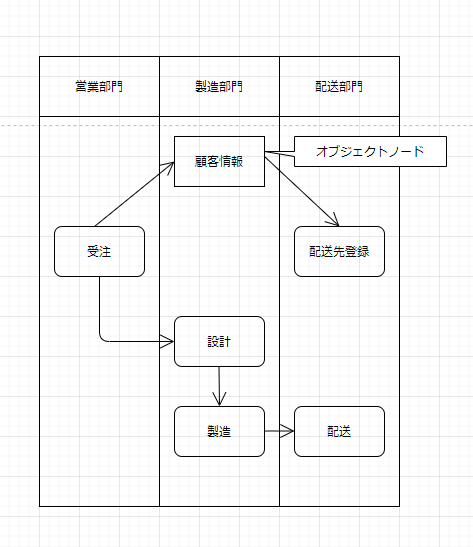

# アクティビティ図

## アクティビティ図とは
* アクティビティ図は、システムや業務の流れを表現するのに使用する。

  

## アクション

* アクションとはその状態でアクティビティ図が終了すると他の状態に遷移する状態のことです。アクションは、角の丸い長方形で表現する。

  

## デシジョンノード・マージノード

* 処理の分岐には、デシジョンノードを使用する。デシジョンノードは菱形で表現する。

* 処理の合流にはマージノードを使用する。マージノードも菱形で表現する。

  
  

## アクティビティパーティション

* アクティビティパーティションを用いることでアクションをまとめることができる。
* 次の図では「営業部門」「製造部門」「配送部門」という3つの組織の単位をレーンで表現しています。「営業部門」で「受注」がされ、「製造部門」で「設計」および「製造」、「配送部門」で「配送先登録」と「配送」が行われている。

    

## アクティビティ図オブジェクト

* アクティビティ図にオブジェクトを表記して、オブジェクトの流れを表現することができる。それによってアクションの各処理と、オブジェクトの生成・参照・更新などの関係を表現することができる。

* アクティビティ図において、オブジェクトはオブジェクトノードで表現する。オブジェクトノードは長方形で表現する。

* 次の図は、「営業部門」の「受注」処理「顧客情報」オブジェクトが生成され、「配送部門」の「配送先登録」に「顧客情報」オブジェクトが渡されることを示している。
    
