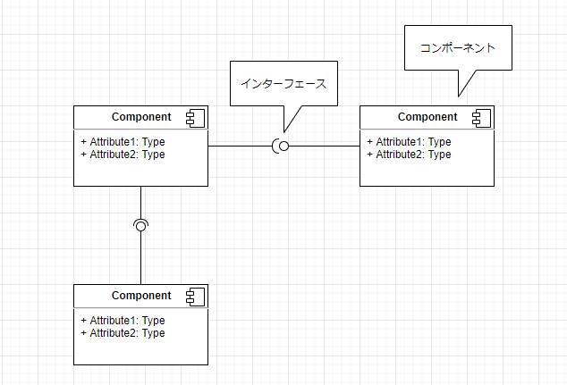
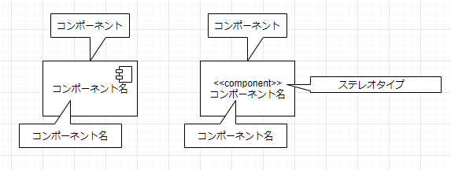
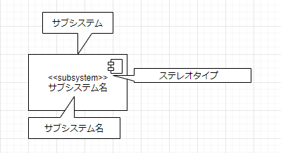
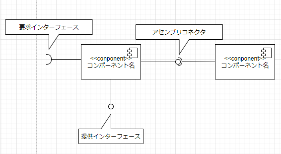
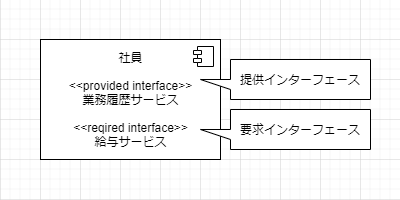
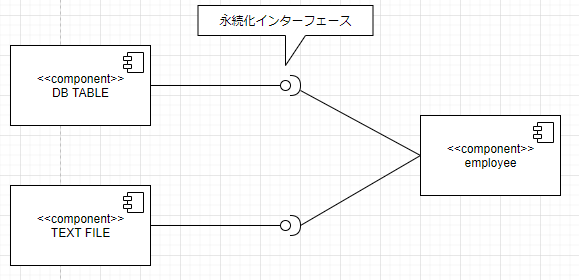
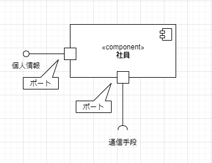
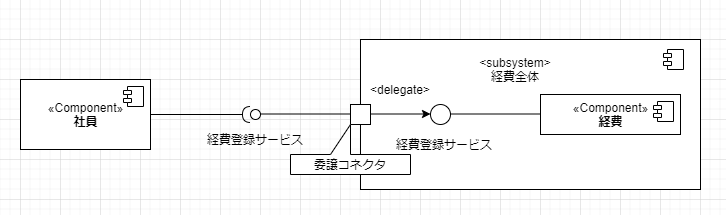

# コンポーネント図

  * 「コンポーネント」とは、1つ以上のインターフェースを持ち、システムやサブシステム内で自立している一つの集合体のこと。

  * コンポーネント図とは、コンポーネント間の関係を明らかにし、システム全体を表現するための図のこと。特に大規模なシステムを実現するためにはアーキテクチャ設計において、システムのアーキテクチャを明確にすることが重要になる。コンポーネント図が完成すれば、システム全体で統一されたアーキテクチャを確認でき、システムの全体構成をイメージすることができる。

## 実装をモデリングする図
* システム開発に際しては、再利用部品の名前や構成だけではなく、実際にシステム運用するハードウェアの構成も考える必要がある。実装をモデリングする図はそういった側面も考慮する必要がある。

  * コンポーネント図
    * システムで利用する再利用部品等、ソフトウェアコンポーネントの構成を表現する。

  * 配置図
    * システム実行時のハードウェアと、そこに配置される成果物等のシステム構成を表現する。

## コンポーネント図とは
* コンポーネント図は、ソフトウェアコンポーネントの構成を表現する。ソフトウェアのコンポーネントとは、あらかじめ決められたインターフェースを持った再利用部品のこと。

* それぞれの再利用部品をコンポーネントで表現し、コンポーネント間の関係はインターフェースで接続して表現している。

* 下記の図はそれぞれの再利用部品をコンポーネントで表記し、コンポーネント間の関係はインターフェースで接続して表現する。
  * 

## コンポーネント
* **コンポーネント**は、ソフトウェアコンポーネントを表現している。

* コンポーネントは、長方形の右上にコンポーネントを表現する小さなアイコンを配置するか、コンポーネント名の上部にステレオタイプを付けて表現する。
  * 

* \<\<subsystem>>というステレオタイプを付けることで、サブシステムを表現することもできる。
  * 

## インターフェース
* インターフェースはクラスおよび**コンポーネント**にもつけることができる。 

* インターフェースには提供インターフェースと要求インターフェースがある。どれぞれ以下を規定する。
  * 提供インターフェース・・・どのようなインターフェース提供するか
  * 要求インターフェース・・・どのようなインターフェースを要求するか

* 提供インターフェースと要求インターフェースで接続されているコネクタを**アセンブリコネクタ**という。
  

  
  
  
* インターフェースでは、操作の呼び出しの仕様を公開し、操作の実装については記述しない。そのため、インターフェースが同じであれば、コンポーネントを入れ替えることもできる。

* 次の図では、「DB TABLE」コンポーネントも「TEXT FILE」コンポーネントも同じ「永続化インターフェース」というインターフェースを持っている。そのため、「employee」コンポーネントに影響を与えずに入れ替えることが可能です。
  

## ポート
* 「ポート」とは、対象の分類子と外部間の相互作用の接点(Interface port)のこと。

* ポート先には相互作用を表すインターフェースを接続する。ポートはコンポーネントの一辺の上に正方形で表す。
  

## 委託コネクタ

* 「委託コネクタ」は、あるコンポーネントのインターフェースの実現をサブシステム内部のコンポーネントやクラスに委譲することを表現するコネクタ。

* 委譲コネクタを描く場合は、ポートからインターフェースに対して矢印で結び、ステレオタイプ\<\<delege>>を配置する。

* 以下の図では「社員クラス」が要求している「経費登録サービス」の実現を「経費全体」サブシステム内部の「経費」コンポーネントに委譲している。
  
