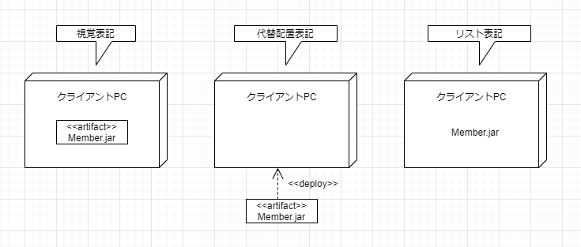
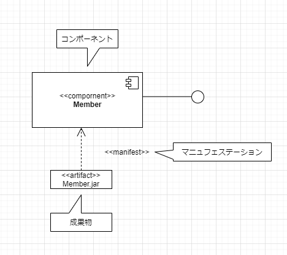

# 配置図の概要

## 配置図とは
* コンポーネント図では、システムを構成しているソフトウェアコンポーネントを表現したが、物理的なファイルを配置するハードウェア構成についても表現する必要がある。

* 配置図は、コンピュータやプリンタといった機器や、ネットワークの接続関係など、システムのハードウェア構成を表現する。
  * 

## 配置図を構成するもの

* 配置図の要素には、コンピュータなどを表現するノードと、実線で表現するノード間の関係がある。また配置図に成果物を配置すると、より詳細な情報を表現することができる。開発環境や実行環境にファイルがどう配置されているかを表現するために使用する。
  * 

## ノード

* 一般的にノードにはコンピュータやプリンタなどハードウェアを表現する装置と、OSなどのソフトウェアを表現する実行環境がある。

* ノードは立方体で表現し、ノード名を中に記述する。ノードが装置の場合はステレオタイプ\<\<device>>を、実行環境の場合は、ステレオタイプ\<\<executionEnviro>>をノード名の上につける。
  * 

* ノードにはノード型とノードインスタンスがある。
  * ノード型
    * ノードの仕様を表現する。

  * ノードインスタンス
    * ノードの具体例を表現する。

## ノード型

* ノード型は、表現しようとしているシステムリソース（コンピュータ等）の仕様を一般的に表現する。

* 例えば、同じ仕様のPCクライアントとして何台か仕様するときに、そのクライアントのPCを一般的にノード型として表現する。　
  * 

## ノードインスタンス

* あるノード型のコンピュータなど、システムリソースを実際に何台か配置する場合は、ノードインスタンスを使用する。ノードインスタンスには、次のように立方体に下線付きの名前とノード付きの名前とノード型を記述する。
  * 

## 成果物

* 成果物はシステムで利用する物理的なファイルを表現する。成果物はソースファイル、実行ファイル、データベースのテーブル、ワープロ文書などを表現する。
  * 

## 成果物の表記

* 成果物は長方形で表現し、成果物名を配置する。ステレオタイプ`<<artifact>>`を付けるか、または右上の角が折れた縦長のアイコンを付けることで表現する。

* 成果物のインスタンスは、成果物名の下に下線を引く。成果物インスタンスは具体的な実例を表現する。
  * 

## 成果物の配置

* 次の図はいずれも、ノード「クライアントPC」に成果物「Member.jar」が配置されていることを示す。
  * 

## マニュフェステーション関係

* 成果物はコンポーネントを実現する。この成果物とコンポーネントの関係を表現するには、依存関係にステレオタイプ`<<manifest>>`を付けて表現する。この関係をマニュフェステーション関係と呼ぶ。
  * 
