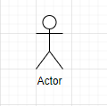
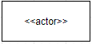
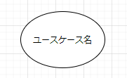
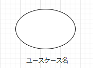

# 01_ユースケース図_概要

* 図の目的
  * システムの要件（ユースケース）と利用者（アクター）の関係を図示し、そのシステムでなにを実現すべきかを見えるようにすること

* 使用する工程
  * 要件定義（システム開発初期）
  * ユースケース図を作成後の工程でクラス図・シーケンス図を作成する。

* ユースケースを書く意義
  * システムを作る場合、まずはじめにシステムで実現すべき目的を明確にすることが必要。このシステムで実現すべき目的をユースケースとアクターの関係として図示したものがユースケース図。 

* ユースケース図を構成するもの
  * アクター
    * 対象とするシステムを起動したり、データのやり取りをしたりする人やもの、他システム（システムの外部）
  * ユースケース
    * 対象とするシステムが提供する機能（システムの内部）
  * 関係
    * アクターとユースケースの関係には関連が適用される
  * システム境界
    * 対象するアイテムの内部と外部の境界

* ユースケース図の目的
  * 開発システムの主要機能を明確にする。
    * 機能の1つ1つがユースケースに1：1で対応するので、すべての機能を網羅するまでユースケースを追加する必用があり、この作業により機能の漏れを防ぐ。
  * 開発範囲を明確にする。
    * システムの開発対象の部分とそうでない部分を明確にする。アクターはシステムの範囲外、ユースケースはシステムの実装すべき機能となっている。そのため何がアクターになっているかを見れば逆にそこから開発範囲が明確となる  
  * ユースケースをユーザから見たシステムの1機能を1つのユースケースをして表現する。この時、システムの全ての機能がユースケースとして表現されている必用がある。逆にシステムとして実現する必用がない機能についてはユースケースとして表現しない。
  * ユースケースのサイズ
    * アクターから見て1つのユースケースを終了すればその目的は達成されており、かつ一つのユースケースの中では中段が行われないこと

* その他
  * ユースケース図を考える際はシステムをブラックボックスとして捉え、内部の構造については気にせず、システムの外部から見てどのような機能が提供されているかだけに着目する。
  * ユースケース図を作成するときは、ユーザ支店で作成する。
  * ユースケース図は、アクター・ユースケース・関係・システム境界で構成されている。
  * ユースケース図は必用であれば何枚でも作成する。

## アクター
* アクターの表現
  * 人型（スティックマン）
    * 
  * ステレオタイプ表記
    * 
  * 人型アイコン以外
    * 

* アクターの候補になるもの
  * 利用者
    * 対象システムを起動したり、システムと直接データをやり取りする利用者
  * 外部のハードウェア
    * 対象システムとデータのやり取りをするハードウェア（バーコードリーダー等、センサー等）
  * 既存のシステム
    * 既存のシステムとデータのやりとりをする場合、そのシステムをアクターとなる。

## ユースケース
* ユースケースの表現
  * 楕円内にユースケース名を記入
    * 
  * 楕円外にユースケース名を記入
    * 
* ユースケースのサイズ
  * 